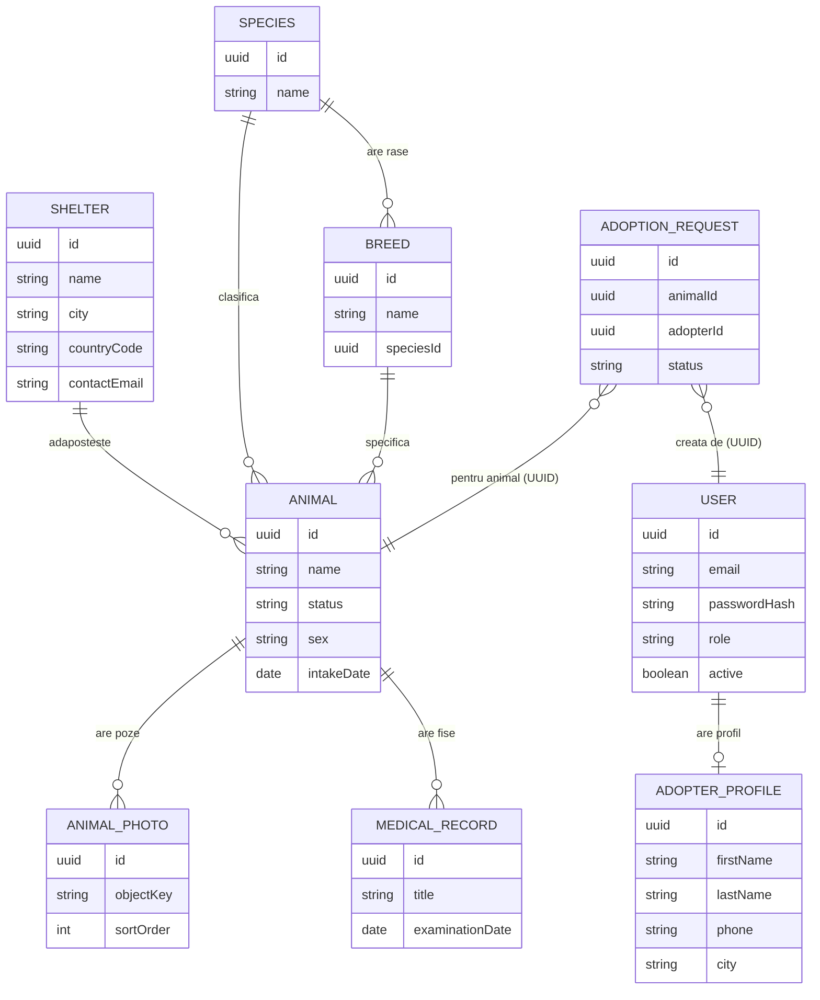

# Paws

Paws este o platforma web pentru adoptie de animale. Aplicatia permite vizitatorilor sa rasfoiasca animalele disponibile, utilizatorilor inregistrati sa trimita cereri de adoptie, iar administratorilor sa gestioneze adaposturile, taxonomia, animalele, fisele medicale si cererile de adoptie.

Proiectul este construit ca un sistem de microservicii pe baza Spring Boot si Spring Cloud, cu o interfata web server-side in Thymeleaf.

## Scopul aplicatiei

Domeniul este adoptia de animale. Un adapost listeaza animale, fiecare animal apartine unei specii si optional unei rase, are poze si un istoric medical. Un adoptator isi creeaza cont, rasfoieste catalogul si trimite o cerere de adoptie pentru un animal disponibil. Administratorul evalueaza cererile si intretine datele din catalog.

## Functionalitati principale

- Rasfoire catalog de animale, inclusiv pentru vizitatori neautentificati
- Pagina de detaliu animal cu poze, badge-uri de status si istoric medical
- Inregistrare, autentificare si delogare
- Profil de adoptator si setari de cont, inclusiv schimbare parola si dezactivare cont
- Trimitere cerere de adoptie pentru animalele cu status disponibil
- Lista cererilor proprii de adoptie si anulare cerere
- Administrare adaposturi, specii, rase, animale si fise medicale
- Administrare cereri de adoptie, cu aprobare sau respingere si nota optionala
- Notificari asincrone la evenimentele din ciclul de viata al adoptiei

## Roluri si control de acces

Sistemul are doua roluri: USER si ADMIN.

- Vizitatorii neautentificati pot rasfoi si vedea animalele, dar nu pot trimite cereri de adoptie.
- Utilizatorii cu rol USER pot trimite cereri de adoptie, isi pot vedea si anula cererile si isi pot gestiona profilul.
- Utilizatorii cu rol ADMIN au acces la zona de administrare si la operatiile de creare, modificare si stergere pentru entitatile din catalog si pentru cererile de adoptie.

Protectia se aplica pe server. Endpoint-urile de modificare din serviciile de business sunt protejate cu adnotari de tip method security, iar interfata ascunde actiunile in functie de rol.

## Flux aplicatie

1. Cererile din browser ajung la web-ui.
2. web-ui apeleaza api-gateway.
3. api-gateway valideaza token-ul JWT si trimite mai departe identitatea prin antete.
4. animal-service raspunde pentru catalog, adaposturi, taxonomie si fise medicale.
5. adoption-service gestioneaza ciclul de viata al cererilor de adoptie si publica evenimente.
6. notification-service consuma evenimentele de adoptie din broker.
7. user-service raspunde pentru autentificare, cont si profil.

## Arhitectura

Aplicatia este organizata ca microservicii independente, coordonate prin Spring Cloud.

| Modul | Port | Responsabilitate |
|---|---|---|
| common | - | cod partajat: suport JWT, antete de gateway, incarcare .env, evenimente de adoptie, aspect de logare |
| config-server | 8888 | Spring Cloud Config in mod native |
| eureka-server | 8761 | service discovery |
| api-gateway | 8080 | punct unic de intrare, rutare, validare JWT, redirectare identitate prin antete |
| user-service | 8081 | autentificare, cont si profil de adoptator |
| animal-service | 8082 | catalog de animale, adaposturi, specii, rase, fise medicale, poze |
| adoption-service | 8083 | ciclul de viata al cererilor de adoptie si publicare de evenimente |
| notification-service | 8084 | consumator de evenimente de adoptie din RabbitMQ |
| web-ui | 8090 | interfata web Thymeleaf |

Comunicarea sincrona se face prin REST, folosind nume de servicii inregistrate in Eureka si load balancing pe partea de client din Spring Cloud. Comunicarea asincrona pentru evenimentele de adoptie se face prin RabbitMQ intre adoption-service si notification-service.

api-gateway valideaza token-ul JWT, verifica o lista de revocare in Redis si injecteaza identitatea utilizatorului in antete catre serviciile din spate. Serviciile de business au incredere in gateway si nu revalideaza token-ul.

## Tehnologii folosite

- Java cu toolchain JDK 25
- Spring Boot 4 si Spring Cloud
- Spring Web MVC, Spring Data JPA, Spring Security, Spring Validation
- Spring Cloud Gateway, Netflix Eureka, Spring Cloud Config
- Thymeleaf si Bootstrap pentru interfata
- PostgreSQL pentru date, Redis pentru lista de revocare a token-urilor
- RabbitMQ pentru mesagerie
- Stocare de obiecte compatibila S3 prin MinIO pentru pozele animalelor
- JSON Web Token pentru autentificare
- JUnit 5, Mockito si Testcontainers pentru testare
- Gradle cu Kotlin DSL, build multi-modul
- Docker Compose pentru infrastructura locala

## Structura proiectului

```
AWBD/
  build.gradle.kts
  settings.gradle.kts
  docker-compose.yml
  common/
  config-server/
  eureka-server/
  api-gateway/
  user-service/
  animal-service/
  adoption-service/
  notification-service/
  web-ui/
  docs/
```

Fiecare serviciu de business respecta o impartire pe pachete in controller, service, repository, entity si dto.

## Model de date

Modelul cuprinde noua entitati persistente, distribuite pe trei servicii cu baze de date proprii.

user-service:
- User: cont de utilizator cu email, parola criptata, rol si stare activa
- AdopterProfile: profilul adoptatorului, cu obiecte valoare incapsulate pentru nume, telefon, oras si experienta cu animale

animal-service:
- Shelter: adapost, cu nume, oras, cod de tara si date de contact
- Species: specie
- Breed: rasa, legata de o specie
- Animal: animalul, cu nume, status, sex, descriere, date si taxa de adoptie
- AnimalPhoto: poza atasata unui animal, cu cheia obiectului din stocare
- MedicalRecord: fisa medicala atasata unui animal

adoption-service:
- AdoptionRequest: cererea de adoptie, cu identificatorul animalului, identificatorul adoptatorului, status si note

Relatiile dintre entitati acopera mai multe tipuri:
- O relatie OneToOne intre User si AdopterProfile.
- Relatii OneToMany si ManyToOne pentru legaturile dintre Shelter si Animal, Species si Breed, Species si Animal, Breed si Animal, Animal si AnimalPhoto, Animal si MedicalRecord.

AdoptionRequest face parte dintr-un alt serviciu si referentiaza animalul si adoptatorul prin identificatori de tip UUID, nu prin chei straine la nivel de baza de date, in conformitate cu separarea pe servicii.

## Diagrama ER

Diagrama de mai jos reflecta entitatile reale si cardinalitatile lor. Legaturile catre AdoptionRequest sunt referinte logice prin UUID intre servicii, nu chei straine.



Pentru referinta, o varianta a modelului de date este pastrata si in folderul docs.

## Operatii CRUD

Fiecare entitate principala are operatii complete de creare, citire, actualizare si stergere expuse prin REST.

- Adaposturile, speciile, rasele si animalele se pot crea, lista, modifica si sterge.
- Fisele medicale se pot crea, lista, modifica si sterge pentru un animal.
- Pozele de animal se pot incarca, lista si sterge.
- Cererile de adoptie se pot crea, lista, vedea, evalua, anula si sterge.
- Utilizatorul are citire de profil, actualizare profil, schimbare parola si dezactivare cont, iar administratorul poate sterge un utilizator.

Operatiile de stergere sunt permise doar pentru rolul ADMIN. La stergere se verifica integritatea referentiala. De exemplu, un adapost, o specie sau o rasa care inca au animale asociate nu pot fi sterse si raspunsul este de tip conflict. La stergerea unui animal se sterg si pozele si fisele medicale asociate, iar la stergerea unui utilizator se sterge si profilul de adoptator.

## Strat de repository si strat de service

Accesul la date se face prin interfete Spring Data JPA. Logica de business sta in clase de service, separata de controllere. Controllerele se ocupa doar de mapare HTTP si delegare catre service, iar maparea catre obiecte de transfer se face tot in stratul de service.

## Validare si tratarea exceptiilor

Validarea pe server se face cu Bean Validation pe obiectele de transfer si pe formulare, prin adnotari precum NotNull, NotBlank, Size, Email, Pattern si Min, impreuna cu Valid in controllere.

Interfata adauga validare pe partea de client prin constrangeri HTML5 si stilul de validare din Bootstrap, cu mesaje de eroare prietenoase afisate langa campuri.

Tratarea exceptiilor se face centralizat. Fiecare serviciu de business are un handler global care transforma erorile de validare si exceptiile de stare HTTP intr-un raspuns de eroare consistent. Interfata web traduce erorile primite de la servicii in mesaje afisate utilizatorului si are pagini de eroare proprii pentru 404, 500 si acces interzis.

## Securitate

Autentificarea se bazeaza pe baza de date. user-service foloseste un UserDetailsService peste Spring Data JPA, un DaoAuthenticationProvider si codare de parola cu BCrypt, iar la autentificare emite un token JWT.

api-gateway valideaza token-ul JWT, verifica o lista de revocare in Redis si trimite identitatea utilizatorului catre serviciile din spate prin antete. Lasa sa treaca neautentificat doar autentificarea, inregistrarea si cererile de tip citire pentru catalogul public. Serviciile de business citesc identitatea din antete si aplica protectie pe rol cu method security pentru operatiile de administrare.

Interfata web pastreaza token-ul intr-un cookie de tip HttpOnly si are un filtru propriu care populeaza contextul de securitate. Are pagina de login proprie, delogare functionala care invalideaza sesiunea si sterge cookie-urile, si protectie CSRF activata pentru formulare.

Functionalitatea de remember me nu este implementata.

## Paginare si sortare

Paginarea si sortarea sunt implementate pentru animale, cereri de adoptie si fise medicale. Endpoint-urile de listare accepta parametrii standard de pagina, dimensiune si sortare si raspund cu o structura paginata. Sunt disponibile mai multe criterii de sortare per entitate, de exemplu dupa nume, data de intrare sau status pentru animale, si dupa data crearii, data actualizarii sau status pentru cererile de adoptie.

Interfata ofera navigare intre pagini, selector pentru dimensiunea paginii cu valori de 5, 10, 20 si 50, si un selector de sortare. Filtrele aplicate se pastreaza in legaturile de paginare.

## Logging

Logarea foloseste SLF4J cu Logback. Fiecare serviciu are o configurare logback-spring.xml cu un appender de consola si un appender de fisier care scrie separat erorile in folderul logs. Nivelurile de logare sunt configurate pe profil. In modulul common exista un aspect care logheaza apelurile din stratul de service, cu durata si erori.

## Testare

Testarea foloseste JUnit 5 si Mockito. Exista teste unitare pentru stratul de service in animal-service, adoption-service si user-service, care acopera caile principale si ramurile de eroare, folosind mock-uri pentru repository si dependinte. Exista teste de integrare end to end cu Testcontainers si MockMvc pentru fluxul de catalog din animal-service si pentru ciclul de viata al cererilor din adoption-service, plus teste pentru mesageria de adoptie.

Configurarea bazei de date pentru teste se face prin Testcontainers, separat de baza de date de dezvoltare.

## Configurare multi-environment

Fiecare modul are profil de dezvoltare si profil de test, in fisiere separate de tip application-dev.yml si application-test.yml. Profilul de dezvoltare foloseste PostgreSQL si serviciile de infrastructura locale, iar profilul de test foloseste baze de date izolate prin Testcontainers. Profilul implicit este dev si poate fi suprascris prin variabila de mediu.

## Privire de ansamblu asupra endpoint-urilor

Toate apelurile externe trec prin api-gateway, sub prefixul /api/v1.

- /api/v1/auth: inregistrare, autentificare si delogare
- /api/v1/users: profil propriu, schimbare parola, dezactivare cont, administrare utilizator
- /api/v1/shelters: adaposturi
- /api/v1/species si /api/v1/breeds: taxonomie
- /api/v1/animals: animale, fise medicale si poze
- /api/v1/adoptions: cereri de adoptie

Cererile de tip citire pentru catalog sunt accesibile public. Operatiile de creare, modificare si stergere necesita autentificare, iar cele de administrare necesita rol ADMIN.

## Interfata

Interfata este server-side, redata cu Thymeleaf si stilizata cu Bootstrap. Cuprinde o pagina principala cu un carusel de animale disponibile, paginile de autentificare si inregistrare, profilul si setarile de cont, lista si detaliul de animal, lista cererilor proprii de adoptie si zona de administrare cu formulare pentru adaposturi, specii, rase, animale, fise medicale si cereri de adoptie. Toate formularele de tip CRUD au validare pe server si pe client.

## Componente avansate

- Service discovery cu Eureka pentru inregistrarea si descoperirea serviciilor.
- API Gateway cu Spring Cloud Gateway pentru rutare centralizata si validare a token-ului.
- Config server cu Spring Cloud Config in mod native.
- Stocare de obiecte compatibila S3 prin MinIO pentru pozele animalelor.
- Lista de revocare a token-urilor in Redis.

## Rulare locala

### Cerinte preliminare

- JDK 25
- Docker Desktop pentru PostgreSQL, Redis, RabbitMQ si MinIO
- Un fisier .env in radacina repository-ului, incarcat de modulul common

Exemplu de variabile asteptate in .env:

```env
DB_USER=awbd
DB_PASSWORD=awbd
DB_NAME=db_users
DB_URL=jdbc:postgresql://localhost:5432/db_users
REDIS_HOST=localhost
REDIS_PORT=6379
JWT_SECRET=secret-base64-de-minim-32-bytes
MINIO_ENDPOINT=http://localhost:9000
MINIO_ROOT_USER=minioadmin
MINIO_ROOT_PASSWORD=minioadmin
MINIO_BUCKET=animal-photos
```

### Pornire infrastructura

```powershell
docker compose up -d
```

Aceasta porneste PostgreSQL, Redis, RabbitMQ si MinIO.

### Pornire servicii

Din radacina proiectului, fiecare serviciu in propriul terminal:

```powershell
./gradlew :eureka-server:bootRun
./gradlew :config-server:bootRun
./gradlew :animal-service:bootRun
./gradlew :user-service:bootRun
./gradlew :adoption-service:bootRun
./gradlew :notification-service:bootRun
./gradlew :api-gateway:bootRun
./gradlew :web-ui:bootRun
```

Eureka trebuie pornit primul, ca celelalte servicii sa se poata inregistra. Serviciile de business trebuie sa fie inregistrate inainte ca gateway-ul sa inceapa sa ruteze. web-ui se porneste ultimul.

### Utilizare

- Interfata web: http://localhost:8090
- Acces prin gateway: http://localhost:8080/api/v1/
- Consola Eureka: http://localhost:8761

## Rulare teste

Testele unitare nu necesita Docker:

```powershell
./gradlew :animal-service:test --tests "*AnimalCatalogServiceTest" --tests "*AnimalPhotoServiceTest"
./gradlew :adoption-service:test --tests "*AdoptionRequestServiceTest"
./gradlew :user-service:test --tests "*UserAccountServiceTest" --tests "*AuthServiceTest"
```

Testele de integrare cu Testcontainers necesita Docker pornit.
