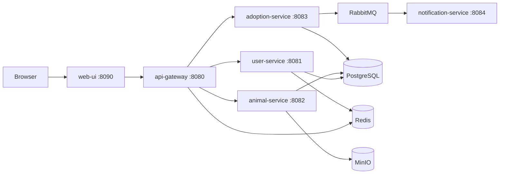

# Current Application Flow

Browser traffic enters through `web-ui`, which calls the `api-gateway`. The gateway validates JWTs, checks token revocation in Redis, and forwards identity headers to the backend services. The animal catalog includes shelters, species, breeds, tags, animals, photos, and medical records. Adoption lifecycle events are published to RabbitMQ and consumed by `notification-service`.
